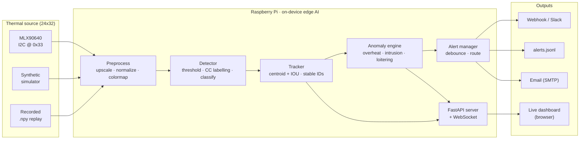
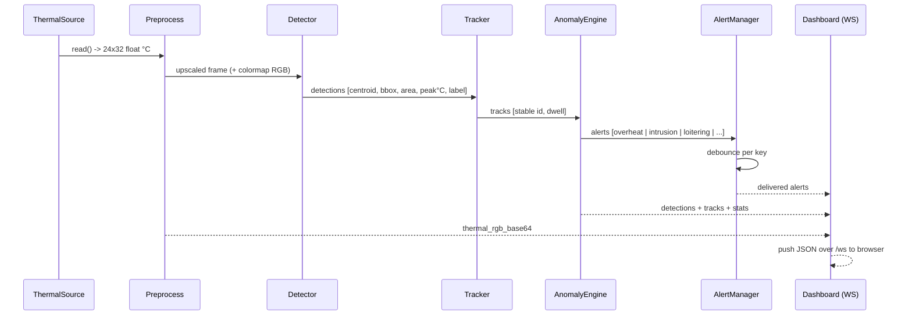

<div align="center">

# 🛰️ thermal-sentry

### Edge thermal AI for the Raspberry Pi — detect people, heat-sources & thermal anomalies on-device, with a live web dashboard and real-time alerting.

[](https://github.com/OCT0PUSPR/thermal-sentry/actions/workflows/ci.yml)
[](https://www.python.org/)
[](LICENSE)
[](https://www.raspberrypi.com/)
[](https://www.melexis.com/en/product/MLX90640/Far-Infrared-Thermal-Sensor-Array)
[](https://github.com/astral-sh/ruff)

</div>

---

> **No Raspberry Pi? No thermal sensor? No problem.**
> `thermal-sentry` ships a fully working **`--simulate`** mode that synthesises realistic
> 24×32 thermal frames (moving warm bodies + sensor noise) so the **entire pipeline —
> detection → tracking → anomaly rules → alerting → dashboard — runs end-to-end on your
> laptop with zero hardware.** When you're ready, flash it onto a Pi and point it at a real
> Melexis MLX90640.

## Why thermal?

A thermal (far-infrared) camera sees **heat, not light**. That makes `thermal-sentry` useful
where ordinary cameras fail or are unwelcome:

- **People detection & counting in total darkness** — no IR illuminators, no privacy-invading imagery.
- **Fire / overheat early-warning** — a server rack, motor, or stove that's running too hot.
- **Restricted-zone intrusion & loitering** — perimeter and safety monitoring.
- **Privacy-respecting occupancy sensing** — a 24×32 thermal grid can count people without identifying them.

It runs **fully on the edge** (on the Pi itself) — no cloud, no streaming video off-device.

## ✨ Features

| | |
|---|---|
| 🔥 **Real thermal pipeline** | Threshold → connected-components → blob detection → classification, tuned and unit-tested. |
| 🧭 **Multi-object tracking** | Stable IDs across frames (centroid + IOU) for people-counting and dwell-time. |
| 🚨 **Anomaly rules** | Overheat/fire, rapid temperature rise, restricted-zone intrusion, loitering, crowding. |
| 📟 **Live ops dashboard** | Dark, real-time web UI: colormapped thermal feed, bounding boxes + IDs + temps, gauges, alert feed, **draw-a-zone** tool, temperature legend. |
| 🛎️ **Pluggable alerting** | Console, JSONL log, webhook (Slack/Discord/HTTP), and an SMTP email channel — all **debounced**, no secrets hardcoded. |
| 🧪 **Laptop-first dev** | Deterministic synthetic source + a numpy-only test suite that passes **without hardware or heavy deps**. |
| 🧩 **Import-guarded hardware** | The package imports cleanly without `board` / `busio` / `RPi.GPIO`. |
| 🐳 **Deploy-ready** | arm64-friendly Dockerfile, docker-compose, and a real **systemd** unit + Pi installer. |

## 🗺️ System architecture



## 🔄 Data flow (one frame)



## 🔌 Hardware (bill of materials)

| # | Component | Notes | Approx. |
|---|-----------|-------|--------:|
| 1 | **Raspberry Pi 4 / 5** (or Pi Zero 2 W) | 64-bit OS recommended; Pi 4/5 for higher FPS. | $35–80 |
| 1 | **Melexis MLX90640 breakout** | Adafruit #4407 (55° FOV) or #4469 (110° wide FOV). 32×24 IR array, I2C. | ~$60 |
| 4 | **Female-female jumper wires** | For the 4-wire I2C connection. | ~$2 |
| 1 | *(optional)* **Raspberry Pi Camera Module 3** | Visible-light fusion / overlay. CSI ribbon. | ~$25 |
| 1 | microSD card (16 GB+) & 5 V/3 A USB-C PSU | Standard Pi essentials. | ~$15 |
| 1 | *(optional)* case / tripod mount | Aim the sensor at the monitored area. | — |

> The MLX90640 is a **far-infrared** sensor — it is **not** a visible camera. The optional Pi
> Camera lets you fuse a visible image alongside the thermal feed.

### MLX90640 ↔ Raspberry Pi wiring (I2C)

The breakout speaks **I2C at address `0x33`**. Only 4 wires:

```
 MLX90640 breakout            Raspberry Pi 40-pin header
 ┌────────────┐
 │ VIN  ●─────┼──────────────▶ Pin 1  · 3V3 power
 │ GND  ●─────┼──────────────▶ Pin 6  · GND
 │ SDA  ●─────┼──────────────▶ Pin 3  · GPIO2 / SDA1
 │ SCL  ●─────┼──────────────▶ Pin 5  · GPIO3 / SCL1
 └────────────┘
```

| MLX90640 pin | Wire | Pi physical pin | Pi function |
|--------------|------|-----------------|-------------|
| `VIN` | red    | **1**  | 3V3 |
| `GND` | black  | **6**  | GND |
| `SDA` | blue   | **3**  | GPIO2 / SDA1 |
| `SCL` | yellow | **5**  | GPIO3 / SCL1 |

> ⚡ **Power it from 3V3 (pin 1), not 5V.** The Adafruit breakout has an onboard regulator and
> level shifting, but its logic and I2C pull-ups reference 3.3 V on a Pi.

Optional **Pi Camera Module**: connect the CSI ribbon to the Pi's camera/CSI connector (blue
stripe toward the Ethernet jack), then enable it with `sudo raspi-config` → *Interface Options*.

## 🍓 Raspberry Pi OS setup

```bash
# 1. Flash Raspberry Pi OS (64-bit, Bookworm) with Raspberry Pi Imager.
# 2. SSH in, then clone the repo:
git clone https://github.com/OCT0PUSPR/thermal-sentry.git
cd thermal-sentry

# 3. One-shot installer: enables I2C @ 800 kHz, builds a venv, installs the
#    MLX90640 driver, and installs the systemd service.
chmod +x deploy/install_pi.sh
sudo ./deploy/install_pi.sh

# 4. Reboot if the installer changed the I2C baudrate, then verify the sensor:
i2cdetect -y 1          # expect a device at 0x33

# 5. Run it (or let systemd do it -- see "Deployment"):
.venv/bin/thermal-sentry run --source mlx90640 --web
# open http://<pi-ip>:8000
```

> **800 kHz I2C** is required for stable 16/32 Hz refresh rates — the installer sets
> `dtparam=i2c_arm_baudrate=800000` in `config.txt` for you.

## 🚀 Quickstart on a laptop (no hardware — `--simulate`)

```bash
git clone https://github.com/OCT0PUSPR/thermal-sentry.git
cd thermal-sentry

python -m venv .venv && source .venv/bin/activate
pip install -r requirements.txt

# Full pipeline + live dashboard against the built-in simulator:
thermal-sentry run --source simulate --web
#   ...or equivalently:  thermal-sentry run --simulate --web
#   ...or the alias:     thermal-sentry serve

# open http://localhost:8000
```

Other useful invocations:

```bash
# Headless: process 200 simulated frames and exit (great for testing alerts).
thermal-sentry run --simulate --frames 200 --bodies 4

# Record a synthetic clip to a .npy for deterministic replay/testing.
thermal-sentry run --simulate --record captures/clip.npy --frames 300

# Replay the recording (works as a stand-in for a real sensor capture).
thermal-sentry run --source file --file captures/clip.npy --web
```

Run it in a container instead (also simulate-by-default, zero hardware):

```bash
docker compose up --build      # -> http://localhost:8000
```

## 🖥️ Dashboard usage

Open **`http://<host>:8000`**. The dark operations dashboard shows:

- **Live thermal feed** — the colormapped 24×32 array (upscaled), with overlaid **bounding
  boxes, track IDs, and per-blob peak temperatures**. People are teal, hotspots red, animals amber.
- **Telemetry gauges** — live **person count**, **max temperature** (tinted by severity),
  active **tracks**, and **FPS**, plus frame count / scene-min / total alerts / source.
- **Alerts feed** — a live, color-coded stream of fired alerts (critical / warning / info).
- **Zone drawing tool** — click **Draw Zone**, click points on the feed to outline a restricted
  polygon, then click **Finish Zone**. The zone is `POST`ed to `/api/zones` and the anomaly
  engine immediately raises **intrusion** alerts for people inside it. **Clear Zones** removes them.
- **Temperature color-scale legend** — maps the palette to °C.

### HTTP / WebSocket API

| Method | Path | Purpose |
|--------|------|---------|
| `GET`  | `/`           | Dashboard (HTML/JS/CSS). |
| `WS`   | `/ws`         | Pushes `{thermal_rgb_base64, detections, tracks, alerts, stats}` per frame. |
| `GET`  | `/health`     | Liveness probe (`{"status":"ok"}`). |
| `GET`  | `/api/stats`  | Latest pipeline stats JSON. |
| `GET`  | `/api/state`  | Full latest frame payload (image omitted). |
| `POST` | `/api/zones`  | Set restricted-zone polygons: `{"zones":[[[x,y],...]]}` (normalised 0–1). |

## 🛎️ Alerting configuration

All config is environment-driven (copy `.env.example` → `.env`). **No secrets are ever
hardcoded** — webhook URLs and SMTP credentials come from env vars only.

```bash
# Console + JSONL are on by default.
TS_ALERTS_CONSOLE=true
TS_ALERTS_JSONL_PATH=captures/alerts.jsonl
TS_ALERTS_DEBOUNCE_SECONDS=15           # suppress identical alerts within 15 s

# Webhook (Slack/Discord/generic). Secret -> env var, never committed.
TS_ALERTS_WEBHOOK_URL=https://hooks.example.com/services/REPLACE_ME

# Email (SMTP). Credentials from the environment only.
TS_ALERTS_EMAIL_ENABLED=true
TS_ALERTS_EMAIL_TO=ops@example.com
TS_ALERTS_SMTP_HOST=smtp.example.com
TS_ALERTS_SMTP_USER=...                 # set in your shell / secrets manager
TS_ALERTS_SMTP_PASSWORD=...
```

**Anomaly rules** (tune via `TS_ANOM_*`):

| Rule | Trigger | Severity | Key env vars |
|------|---------|----------|--------------|
| `overheat` | any blob/pixel peak ≥ threshold | critical | `TS_ANOM_OVERHEAT_TEMP_C` |
| `rapid_rise` | scene-max rose ≥ Δ within a window | warning | `TS_ANOM_RAPID_RISE_DELTA_C`, `..._WINDOW_S` |
| `zone_intrusion` | a person inside a restricted polygon | critical | (zones via dashboard / `TS_ANOM_RESTRICTED_ZONES`) |
| `loitering` | a person dwelt ≥ N seconds | warning | `TS_ANOM_LOITER_SECONDS` |
| `crowding` | person count exceeds limit | warning | `TS_ANOM_MAX_PERSON_COUNT` |

## 🎚️ Calibration notes

Thermal detection is only as good as its thresholds. Tips:

- **Ambient baseline.** The detector uses an **adaptive threshold** (`background median + k·σ`,
  with `k = TS_DET_ADAPTIVE_K`) combined with a floor (`TS_DET_HOT_THRESHOLD_C`). In a warm room,
  raise the floor; for subtle heat sources, lower `k`.
- **Person temperature band.** Clothed humans typically read **~30–35 °C** at the sensor (skin is
  hotter, clothing cooler, and distance lowers the apparent temperature). Adjust
  `TS_DET_PERSON_MIN_TEMP_C` / `..._MAX_TEMP_C`.
- **Area bands ≈ distance.** A person nearby fills more pixels than one far away. Because detection
  runs on the *upscaled* frame, `TS_DET_PERSON_MIN_AREA` / `..._MAX_AREA` scale with
  `TS_UPSCALE`. Re-tune if you change the upscale factor.
- **Emissivity.** The MLX90640 assumes ε ≈ 0.95 (good for skin and most matte surfaces). Shiny
  metal reads low — add an emissivity offset upstream if you monitor bare metal.
- **Warm-up & self-heating.** Let the sensor stabilise for ~1–2 minutes after power-on; its own
  electronics add a small offset that the adaptive threshold absorbs.
- **Refresh-rate vs. noise.** Higher `TS_MLX_REFRESH_RATE` = more frames but noisier; 8 Hz is a
  good default. 16/32 Hz need the 800 kHz I2C clock.
- **Display scaling.** `TS_TEMP_DISPLAY_MIN_C` / `..._MAX_C` only affect the *colormap* range on
  the dashboard, not detection.

## 🧠 Learned model (from-scratch CNN) — optional ML detector

`thermal-sentry` ships a **small CNN built from scratch in PyTorch** (plain
`conv`/`BN`/`ReLU`/`pool` blocks — no pretrained backbones) with **two heads**:

- a **classification** head (`background` / `person` / `animal` / `hotspot`), and
- a **center-heatmap** detection head that localises warm-body centers.

It runs on the (lightly up-scaled) 24×32 thermal frame and is exposed as a
**selectable detector backend** — the classical threshold+connected-components
detector stays as the always-available fallback.

```bash
TS_ML_BACKEND=ml thermal-sentry run --simulate --web      # full-frame ML detector
TS_ML_BACKEND=onnx thermal-sentry run --simulate          # ML refines classical labels
TS_ML_BACKEND=classical thermal-sentry run --simulate     # heuristic only (default)
```

If the model file is missing or fails to load, the pipeline **silently falls
back to the classical detector**, so it always runs.

### Real measured metrics (held-out synthetic split)

Trained locally on Apple-Silicon **MPS**, 6,000 train / 1,500 val frames, 30
epochs, **~35 s**, **22,517 parameters**:

| Classification acc | Macro-F1 | Localisation recall | Localisation precision |
|---:|---:|---:|---:|
| **0.991** | **0.991** | **0.988** | **0.992** |

### Quantization for the Pi

| Model | Size | Accuracy | Δ vs FP32 |
|---|---:|---:|---:|
| FP32 ONNX | 90.7 KB | 0.988 | — |
| **INT8 ONNX** (static QDQ) | **39.3 KB** | 0.986 | **−0.25 pp** (−56.7 % size) |

> INT8 **TFLite** export is attempted via `tensorflow`+`onnx2tf` but that heavy
> tooling **does not build on Apple-Silicon macOS**, so the shipped edge artefact
> is the **INT8 ONNX** (it runs on the Pi's CPU via `onnxruntime`). On an x86
> Linux build box, `scripts/export.py` will additionally emit
> `models/thermal_cnn_int8.tflite`.

### Train / export / evaluate (local)

```bash
pip install -r requirements.txt -r requirements-train.txt   # torch, onnx, onnxruntime

python scripts/train.py        # trains (MPS>CUDA>CPU auto) -> models/thermal_cnn.pt + report
python scripts/export.py       # FP32 ONNX + INT8 (static QDQ) ONNX (+ TFLite if tooling runs)
python scripts/eval.py         # held-out metrics + INT8-vs-FP32 accuracy delta
```

### Scale-up & retraining (more / real data, GPU)

`scripts/retrain_scaleup.py` trains a stronger model — more synthetic frames and
epochs on a GPU, and/or **fine-tuning on real recorded thermal clips**:

```bash
# 1. Record real frames on the Pi (each .npy is an (N, 24, 32) deg-C sequence):
thermal-sentry run --source mlx90640 --record captures/real_clip.npy --frames 2000

# 2. On a GPU box, weak-label them with the classical detector and scale up:
python scripts/retrain_scaleup.py --real-glob "captures/*.npy" \
    --n-train 40000 --epochs 60 --device cuda --out models/thermal_cnn_prod.pt

# 3. Re-export + quantise the production checkpoint:
python scripts/export.py --checkpoint models/thermal_cnn_prod.pt
```

For best accuracy, replace the weak-labels with hand annotations. See
[`ARCHITECTURE.md`](ARCHITECTURE.md) for the full model + training + quantization
write-up.

## 🛠️ Deployment (systemd)

The Pi installer registers a service for you. Manually:

```bash
sudo cp deploy/thermal-sentry.service /etc/systemd/system/
sudo systemctl daemon-reload
sudo systemctl enable --now thermal-sentry

sudo systemctl status thermal-sentry
journalctl -u thermal-sentry -f          # live logs
```

The unit runs `thermal-sentry run --source mlx90640 --web` as the `pi` user, loads `.env`,
restarts on failure, and waits for the I2C bus on boot. See
[`deploy/thermal-sentry.service`](deploy/thermal-sentry.service).

For containers, `docker-compose.yml` includes a commented `devices: /dev/i2c-1` passthrough block
for driving the real sensor from inside the container on a Pi.

## 🌳 Project structure

```
thermal-sentry/
├── thermalsentry/
│   ├── __init__.py            # version, frame geometry constants
│   ├── config.py              # pydantic-settings, env-driven config
│   ├── app.py                 # runtime loop: read->preprocess->detect->track->alert
│   ├── cli.py                 # `thermal-sentry run|serve`
│   ├── sensors/
│   │   ├── base.py            # ThermalSource protocol + factory
│   │   ├── simulator.py       # synthetic 24x32 frames (the laptop workhorse)
│   │   ├── file_source.py     # .npy replay
│   │   └── mlx90640.py        # Adafruit MLX90640 driver (import-guarded)
│   ├── processing/
│   │   └── preprocess.py      # bilinear upscale, normalize, ironbow/inferno LUTs
│   ├── detection/
│   │   ├── detector.py        # threshold + CC + classify; routes to ML detector
│   │   ├── tracker.py         # centroid/IOU tracker, stable IDs
│   │   └── anomaly.py         # overheat / intrusion / loitering / crowding rules
│   ├── ml/                    # from-scratch two-head CNN (torch-guarded)
│   │   ├── model.py           # ThermalNet: conv/BN/ReLU/pool + cls + heatmap heads
│   │   ├── dataset.py         # synthetic + augmented frame/crop datasets (numpy)
│   │   ├── train.py           # AdamW + cosine LR + metrics (MPS>CUDA>CPU)
│   │   ├── eval.py            # held-out eval (FP32 vs INT8)
│   │   ├── export.py          # ONNX + INT8 (static QDQ) ONNX (+ TFLite if able)
│   │   └── backends.py        # selectable ML detector / crop-classifier backends
│   ├── alerts/                # console/JSONL/webhook/email/MQTT/Telegram, debounced
│   ├── persistence/           # SQLAlchemy event store + retention (Alembic)
│   ├── observability.py       # structlog JSON logs + Prometheus metrics
│   ├── runtime.py             # async runtime: queue + watchdog + recovery
│   └── web/
│       ├── server.py          # FastAPI + WebSocket + auth + history API
│       ├── security.py        # API-key / session / CORS / headers
│       └── static/            # index.html, app.js, style.css, login.html
├── scripts/                   # train.py, export.py, eval.py, retrain_scaleup.py
├── models/                    # tiny committed proof artefacts (ONNX, INT8 ONNX, .pt)
├── alembic/                   # DB migrations
├── deploy/                    # systemd unit + Pi installer
├── tests/                     # pytest suite (numpy-only path; torch tests skip)
├── requirements.txt           # core (laptop + Pi runtime)
├── requirements-pi.txt        # Pi-only hardware deps (adafruit, RPi.GPIO)
├── requirements-dev.txt       # lint + test (onnxruntime, sqlalchemy, ...)
├── requirements-train.txt     # ML train/export (torch, onnx) -- not for CI/runtime
├── ARCHITECTURE.md            # model + metrics + quantization + hardening write-up
├── pyproject.toml
├── Dockerfile                 # arm64-friendly
├── docker-compose.yml
├── .env.example
└── .github/workflows/ci.yml   # ruff + mypy + bandit + pytest + alembic (no hardware)
```

## 🧪 Tests

```bash
pip install -r requirements-dev.txt
pytest -q
ruff check thermalsentry tests
```

The suite runs with **numpy only** — no hardware, no fastapi, no model weights — covering
simulator determinism & temperature ranges, the ironbow/inferno LUTs, detector blob-counting,
tracker ID stability, every anomaly rule, alert debouncing, and the end-to-end simulate pipeline.

## 🗺️ Roadmap

- [ ] **Pi Camera fusion** — overlay/register the visible image with the thermal feed.
- [x] **From-scratch CNN detector** — two-head (classification + center-heatmap) ONNX/INT8 model, edge-only, selectable backend.
- [ ] **Sub-pixel thermal super-resolution** between MLX frames.
- [ ] **MQTT / Home Assistant** alert channel.
- [ ] **Multi-sensor rooms** — fuse several MLX90640s for wider coverage.
- [ ] **Recording browser** in the dashboard (scrub past clips & alerts).
- [ ] **On-device calibration wizard** (auto-tune thresholds to the room).

## 📄 License

[MIT](LICENSE) © 2026 **OCT0PUSPR**.

> ⚠️ **Safety disclaimer:** `thermal-sentry` is a monitoring aid, **not** a certified
> life-safety or fire-detection system. Do not rely on it as your sole smoke/fire detector or
> security system. Always use approved, certified equipment for life-safety applications.
